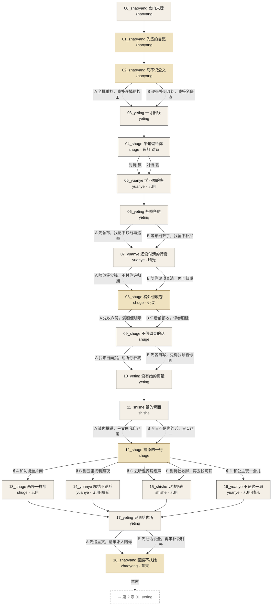
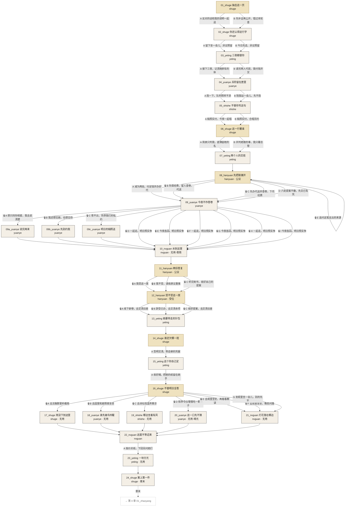
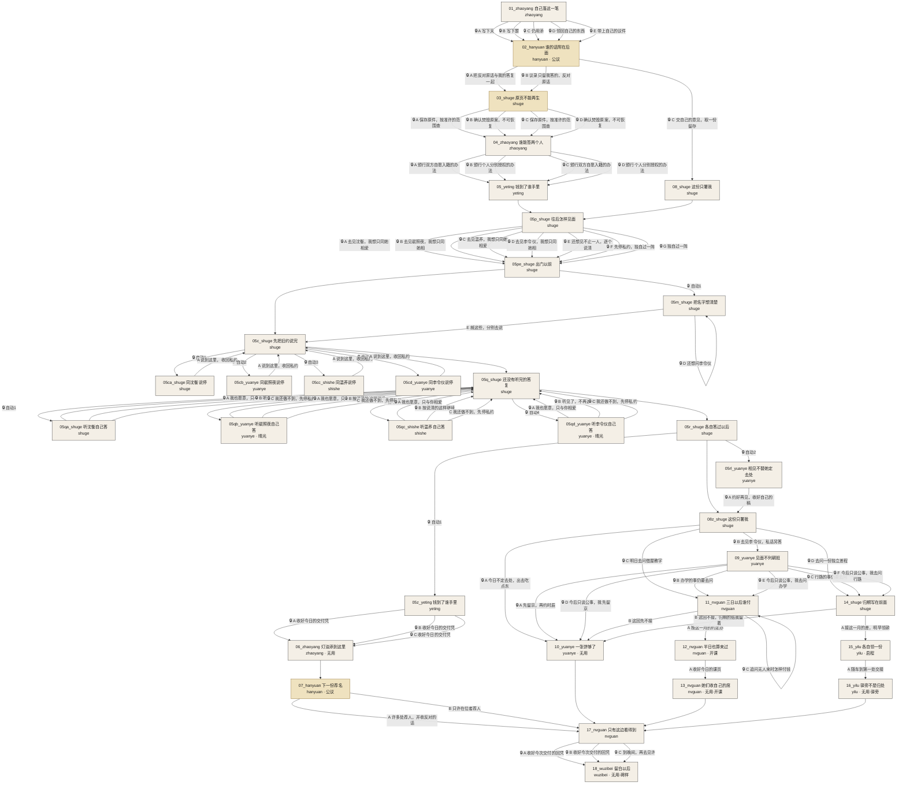

# 剧情分支图

> 由 `tools/convert-story.ts` 在每次转换后生成，读的是 `src/data/converted/`（CC2 转换产物），覆盖已交付的所有章。不要手改。
> CC1 的 `npm run graph` 读正式数据，正式数据接入之前它只画得出第一章；两者不一致时以这一份为准。

起点 `ch01_s00_zhaoyang`。纸色是水墨、绢色是金碧；**朱砂描边是从起点走不到的孤儿**；虚线框是还没交付、只被指向的场；🔒 是有条件的选项；虚线箭头是章末结算后的去向。

## 摘要

| 章 | 场数 | 从起点可达 | 孤儿 | 章末 | 无用场景 | 有布置 | 指向未交付 |
|---|---|---|---|---|---|---|---|
| 1 | 19 | 19 | 0 | 1 | 5 | 5 | 无 |
| 2 | 26 | 26 | 0 | 1 | 7 | 3 | 无 |
| 3 | 27 | 27 | 0 | 1 | 7 | 5 | 无 |
| 4 | 35 | 35 | 0 | 0 | 5 | 9 | 无 |

## 第 1 章

## 第 2 章

```mermaid
flowchart TD
  classDef ink fill:#f4efe6,stroke:#3a3a3a,color:#1a1a1a
  classDef gold fill:#efe2bf,stroke:#8a6a2a,color:#1a1a1a
  classDef orphan stroke:#b23a2a,stroke-width:3px
  classDef pending fill:#ffffff,stroke:#999,stroke-dasharray:4 3,color:#666
  ch02_s01_yeting["01_yeting 先问她<br/>yeting"]:::ink
  ch02_s02_yeting["02_yeting 复一遍再记<br/>yeting"]:::ink
  ch02_s03_nvguan["03_nvguan 门不能替人开<br/>nvguan"]:::ink
  ch02_s04_shuge["04_shuge 请你替我读<br/>shuge"]:::ink
  ch02_s05_yeting["05_yeting 折不到一个角<br/>yeting · 无用"]:::ink
  ch02_s06_yeting["06_yeting 钱与去处分开算<br/>yeting"]:::ink
  ch02_s07_yuanye["07_yuanye 把这一头交给我<br/>yuanye"]:::ink
  ch02_s08_shuge["08_shuge 这也算差务<br/>shuge"]:::gold
  ch02_s09_shishe["09_shishe 这句先让我听见<br/>shishe"]:::ink
  ch02_s10_nvguan["10_nvguan 夜谈二：不算数，就不算吗<br/>nvguan · 无用"]:::ink
  ch02_s11_hanyuan["11_hanyuan 谁准拆这封信<br/>hanyuan · 公议"]:::gold
  ch02_s12_yeting["12_yeting 别请我替你说好话<br/>yeting · 夜灯"]:::ink
  ch02_s13_hanyuan["13_hanyuan 封到哪，读到哪<br/>hanyuan · 公议"]:::gold
  ch02_s14_zhaoyang["14_zhaoyang 披帛留不住人<br/>zhaoyang"]:::gold
  ch02_s15_shuge["15_shuge 墨渍像什么<br/>shuge · 无用"]:::ink
  ch02_s16_yuanye["16_yuanye 两块总不一样<br/>yuanye · 无用"]:::ink
  ch02_s17_shishe["17_shishe 给影子起怪名<br/>shishe · 无用"]:::ink
  ch02_s18_yuanye["18_yuanye 歪枝还往哪里弯<br/>yuanye · 无用"]:::ink
  ch02_s19_nvguan["19_nvguan 这一颗也酸<br/>nvguan · 无用"]:::ink
  ch02_s20_hanyuan["20_hanyuan 资格不是许诺<br/>hanyuan"]:::gold
  ch02_s21_nvguan["21_nvguan 她们另定一个时辰<br/>nvguan"]:::ink
  ch02_s22_shuge["22_shuge 不只写赞成<br/>shuge"]:::gold
  ch02_s23_hanyuan["23_hanyuan 名单有两行<br/>hanyuan"]:::gold
  ch02_s24_shuge["24_shuge 两份都给你<br/>shuge · 章末"]:::ink
  ch02_s25_yeting["25_yeting 那天我在<br/>yeting"]:::ink
  ch02_s26_shuge["26_shuge 剩下的正好<br/>shuge"]:::ink
  ch02_s01_yeting --> ch02_s02_yeting
  ch02_s02_yeting -->|"A 现在逐项查清，请门外的人"| ch02_s03_nvguan
  ch02_s02_yeting -->|"B 午后再查，给她留半日"| ch02_s03_nvguan
  ch02_s03_nvguan --> ch02_s04_shuge
  ch02_s04_shuge -->|"A 一起读。读完也想见你"| ch02_s05_yeting
  ch02_s04_shuge -->|"B 一起读，私下相见先缓缓"| ch02_s05_yeting
  ch02_s04_shuge -->|"C 我只核这卷，不约私见"| ch02_s05_yeting
  ch02_s04_shuge -->|"D 这次陪读我也接不下"| ch02_s05_yeting
  ch02_s05_yeting --> ch02_s06_yeting
  ch02_s06_yeting -->|"A 先垫修栏的钱，今日付清"| ch02_s07_yuanye
  ch02_s06_yeting -->|"B 先付六件，余下三件另催"| ch02_s07_yuanye
  ch02_s07_yuanye -->|"A 我查欠了什么，你去问她"| ch02_s08_shuge
  ch02_s07_yuanye -->|"B 我查行程，你列齐粮数"| ch02_s08_shuge
  ch02_s07_yuanye -->|"C 这回不接，请另找人查"| ch02_s08_shuge
  ch02_s08_shuge -->|"A 连往返按半日给俸"| ch02_s09_shishe
  ch02_s08_shuge -->|"B 按次给俸，往返另记"| ch02_s09_shishe
  ch02_s09_shishe -->|"A 我陪读，有刺耳的就停"| ch02_s10_nvguan
  ch02_s09_shishe -->|"B 我先听完，再逐句说"| ch02_s10_nvguan
  ch02_s09_shishe -->|"C 这次我也没余力陪读"| ch02_s10_nvguan
  ch02_s10_nvguan --> ch02_s11_hanyuan
  ch02_s11_hanyuan -->|"A 先收住议抄，再查原封"| ch02_s12_yeting
  ch02_s11_hanyuan -->|"B 先查原封，再收住议抄"| ch02_s12_yeting
  ch02_s12_yeting --> ch02_s13_hanyuan
  ch02_s13_hanyuan -->|"A 整封限人查阅，另抄公务部"| ch02_s14_zhaoyang
  ch02_s13_hanyuan -->|"B 核存公务部分，把私信退还"| ch02_s14_zhaoyang
  ch02_s14_zhaoyang -->|"🔒 A 去沈衡那里看墨渍"| ch02_s15_shuge
  ch02_s14_zhaoyang -->|"🔒 B 和裴照夜分一块饼"| ch02_s16_yuanye
  ch02_s14_zhaoyang -->|"🔒 C 去温荞那里看窗影"| ch02_s17_shishe
  ch02_s14_zhaoyang -->|"🔒 D 与李令仪看那根歪枝"| ch02_s18_yuanye
  ch02_s14_zhaoyang -->|"E 到观里歇一会儿"| ch02_s19_nvguan
  ch02_s15_shuge --> ch02_s20_hanyuan
  ch02_s16_yuanye --> ch02_s20_hanyuan
  ch02_s17_shishe --> ch02_s20_hanyuan
  ch02_s18_yuanye --> ch02_s20_hanyuan
  ch02_s19_nvguan --> ch02_s20_hanyuan
  ch02_s20_hanyuan -->|"A 三处联署，列清避嫌与申辩"| ch02_s21_nvguan
  ch02_s20_hanyuan -->|"B 限期自行答问，列清路费与"| ch02_s21_nvguan
  ch02_s21_nvguan --> ch02_s25_yeting
  ch02_s25_yeting -->|"A 今夜交给你，我去备稿"| ch02_s22_shuge
  ch02_s25_yeting -->|"B 撤回代答，我自己另排时辰"| ch02_s22_shuge
  ch02_s22_shuge -->|"A 我在门边等你"| ch02_s23_hanyuan
  ch02_s22_shuge -->|"B 今日先走，你慢慢收"| ch02_s23_hanyuan
  ch02_s23_hanyuan -->|"A 收下候选文书，准备逐项比"| ch02_s26_shuge
  ch02_s26_shuge --> ch02_s24_shuge
  ch02_s24_shuge -.->|"章末"| ch03_s01_shuge
  ch03_s01_shuge["→ 第 3 章 01_shuge"]:::pending
```

## 第 3 章

## 第 4 章

