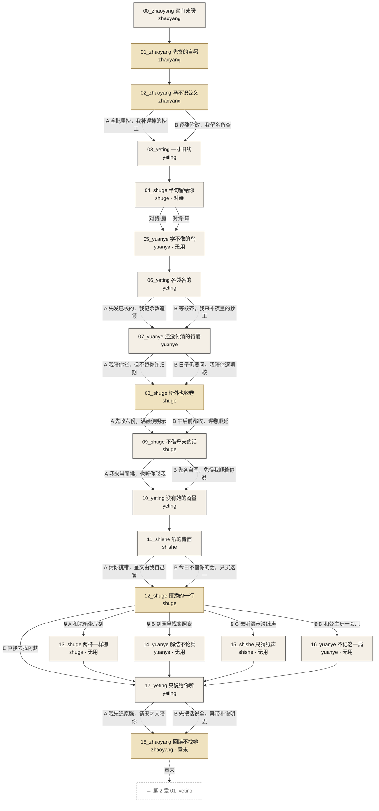
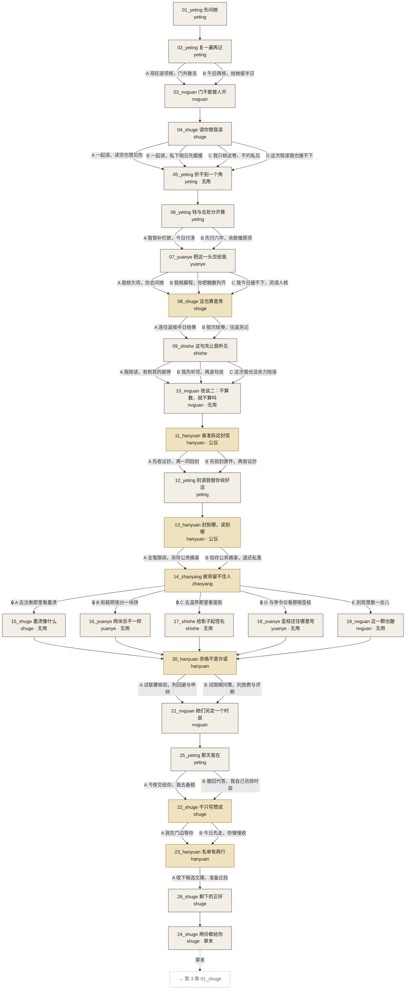
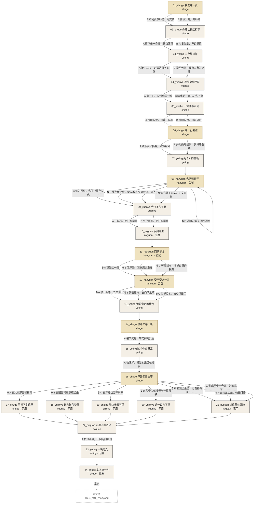

# 剧情分支图

> 由 `tools/convert-story.ts` 在每次转换后生成，读的是 `src/data/converted/`（CC2 转换产物），覆盖已交付的所有章。不要手改。
> CC1 的 `npm run graph` 读正式数据，正式数据接入之前它只画得出第一章；两者不一致时以这一份为准。

起点 `ch01_s00_zhaoyang`。纸色是水墨、绢色是金碧；**朱砂描边是从起点走不到的孤儿**；虚线框是还没交付、只被指向的场；🔒 是有条件的选项；虚线箭头是章末结算后的去向。

## 摘要

| 章 | 场数 | 从起点可达 | 孤儿 | 章末 | 无用场景 | 公议布置 | 指向未交付 |
|---|---|---|---|---|---|---|---|
| 1 | 19 | 19 | 0 | 1 | 5 | 0 | 无 |
| 2 | 26 | 26 | 0 | 1 | 7 | 2 | 无 |
| 3 | 24 | 24 | 0 | 1 | 7 | 3 | `ch04_s01_zhaoyang` |

## 第 1 章

## 第 2 章

## 第 3 章

