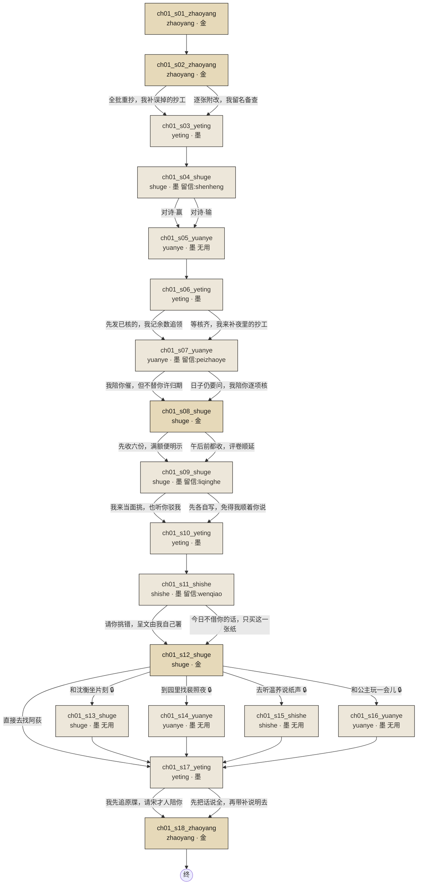

# 剧情分支图

> 由 `tools/story-graph.ts` 生成，不要手改。数据变了重新跑 `npm run graph`。
> 生成时间：2026-09-10 23:46

绢色是金碧场景，纸色是水墨场景，**朱砂描边的是从开场走不到的孤儿场景**。
带锁的边表示这个选项有条件。

## 摘要

| 项 | 数 |
|---|---|
| 场景 | 18 |
| 其中金碧 | 5 |
| 其中无用场景 | 5 |
| 留信的场景 | 4 |
| 走不到的孤儿 | 0 |
| 终点（无出口） | 1 |

## 按幕

**第 1 幕**（18 场，无用场景 5 场）

- `ch01_s01_zhaoyang` zhaoyang／金碧　发现先签自愿的试项与牵马人的实际安排不符
- `ch01_s02_zhaoyang` zhaoyang／金碧　把先告知再署名写进本批试才手续，并承担更正成本
- `ch01_s03_yeting` yeting／水墨　得到具体的照料和私下倾诉，为后来误用私话留下可信根源
- `ch01_s04_shuge` shuge／水墨　两人对沉默如何入卷互不让步，却愿意继续相处
- `ch01_s05_yuanye` yuanye／水墨　两个人容许自己什么也不做成
- `ch01_s06_yeting` yeting／水墨　改掉缺一人便扣整组领物的办法，并分担核账成本
- `ch01_s07_yuanye` yuanye／水墨　亲手接近那匹马，也看见裴照夜不敢轻许归期的缘由
- `ch01_s08_shuge` shuge／金碧　宫内策问试收无荐卷，以明确限额或时限分担经办成本
- `ch01_s09_shuge` shuge／水墨　看见公主既有自己的判断，也被母亲的评价遮住
- `ch01_s10_yeting` yeting／水墨　两个经办女人自行安排病舍核领，不等主角来解题
- `ch01_s11_shishe` shishe／水墨　雨中抢收纸张，温荞先付抄工，再让主角看自己被撤掉的署名
- `ch01_s12_shuge` shuge／金碧　主角把阿荻私话写成可辨认的匿名例证，自以为署名就能承担后果
- `ch01_s13_shuge` shuge／水墨　两个人为茶的浓淡认真一会儿，又不必分出答案
- `ch01_s14_yuanye` yuanye／水墨　两人慢慢拆开一个越帮越紧的衣带结
- `ch01_s15_shishe` shishe／水墨　只听两张纸的声音，猜错也可以笑
- `ch01_s16_yuanye` yuanye／水墨　公主与主角用落叶投石缝，风把输赢一起吹走
- `ch01_s17_yeting` yeting／水墨　玩家先看见阿荻认出细节，再看主角发现善意并没有取得许可
- `ch01_s18_zhaoyang` zhaoyang／金碧　补件不能抹去原牒，首次核问已经沿细节指向阿荻
